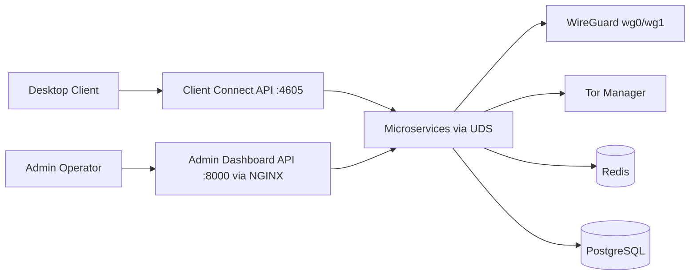

  

# Tornado VPN

Enterprise-grade self-hosted VPN control plane with dual-lane WireGuard routing, Tor transparent proxy integration, microservice supervision over Unix sockets, and real-time operational visibility.

## Executive Summary

Tornado VPN provides a production-focused architecture for secure remote access and privacy-aware routing:

- Standard VPN lane over `wg0` and Tor-routed lane over `wg1`
- Encrypted login payload exchange using X25519 ECDH + AES-GCM
- JWT-based auth with rotating asymmetric keys and overlap-safe verification
- Supervisor-managed microservice mesh with health-driven restarts
- Admin control plane for users, sessions, services, logs, metrics, and relay operations

## Core Capabilities

- Dual interface provisioning and peer orchestration (`wg0` + `wg1`)
- Redis-backed live session state and event fanout
- PostgreSQL-backed user and session history persistence
- Structured logs with query/export and real-time tail support
- Key bootstrap and rotation lifecycle with signal-based service reload

## High-Level Architecture

## Documentation

Primary documentation lives under `docs/` and is organized for platform, security, and operations use.

- Architecture: [docs/architecture.md](D:/tornado-vpn/docs/architecture.md)
- Security: [docs/security.md](D:/tornado-vpn/docs/security.md)
- API Reference: [docs/api_reference.md](D:/tornado-vpn/docs/api_reference.md)
- Operations Runbook: [docs/operations.md](D:/tornado-vpn/docs/operations.md)
- Operator Quick Reference: [docs/cheatsheet.md](D:/tornado-vpn/docs/cheatsheet.md)
- Setup and Installation: [docs/setup.md](D:/tornado-vpn/docs/setup.md)

If you use MkDocs, start from [docs/index.md](D:/tornado-vpn/docs/index.md).

## Repository Layout

- `server/`: backend microservices, APIs, setup, schema
- `client/`: Linux and Windows desktop clients and packaging
- `docs/`: source documentation
- `assets/`: shared branding and icon assets

## Installation & Setup

For comprehensive instructions on deploying the Tornado VPN server stack—including system requirements, necessary firewall rules, cloud deployment guidelines, and post-installation verification—please refer to our complete setup documentation:

**[Read the Tornado VPN Setup Guide](https://tornado-vpn.github.io/tornado/docs/setup)**

---

## Product Visuals

### Dashboard

### Client

## License

GPL-3.0. See [LICENSE](D:/tornado-vpn/LICENSE) and attribution data in [ATTRIBUTIONS.md](D:/tornado-vpn/ATTRIBUTIONS.md).
