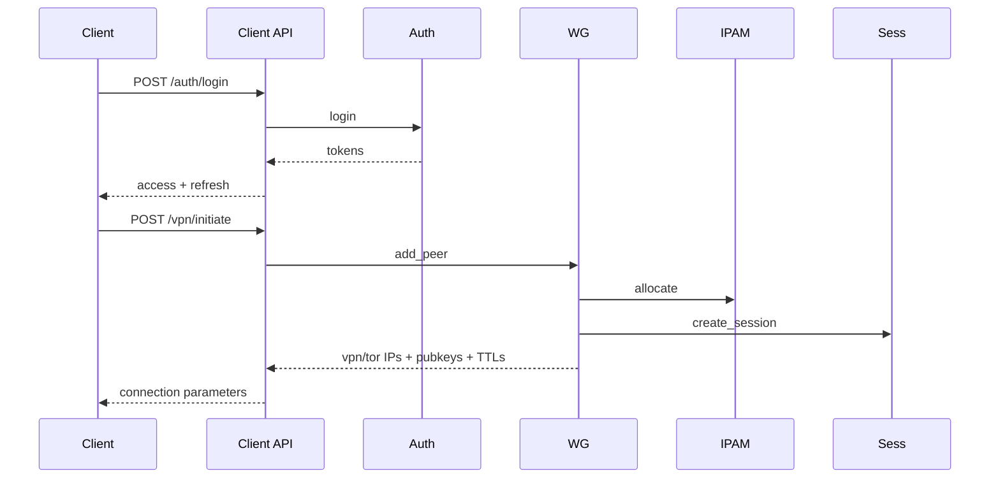

# API and Service Contracts

## Overview

Tornado VPN exposes two HTTP APIs and multiple internal UDS services.

- External/admin API: `server/web-interfaces/admin-dashboard/main.py`
- External/client API: `server/web-interfaces/client-connect/main.py`
- Internal mesh: `server/microservices/*.py` over `/run/tornado/*.sock`

## Client API (`:4605`) Key Endpoints

| Method | Path | Purpose |
|---|---|---|
| GET | `/health` | service readiness |
| GET | `/auth/pubkey` | fetch X25519 public key for encrypted login |
| POST | `/auth/login` | encrypted credential login |
| POST | `/auth/logout` | revoke refresh/session context |
| POST | `/auth/reauth` | refresh token exchange |
| POST | `/vpn/initiate` | allocate IPs and program peer |
| POST | `/session/heartbeat` | keepalive and recovery trigger |
| POST | `/vpn/verify/id` | token identity check |

## Admin API (`:8000`, proxied) Key Domains

- Auth routes (`/auth/*`)
- Dashboard live websocket (`/ws/dashboard`)
- Metrics (`/api/metrics/*`, `/ws/metrics/live`)
- Session administration (`/api/admin/sessions`, session kill routes)
- User lifecycle (`/users`, suspend/revoke/delete, user sessions)
- Log service integration (`/logs/*`)
- OS service controls (`/services/*`)
- API app controls (`/apps/*`)
- Tor relay controls (`/up`, `/down`, `/start_service`, `/stop_service`, `/circuits`)
- Key rotator controls (`/api/key-rotator/*`)

## UDS Services and Primary Actions

| Service | Socket | Primary Actions |
|---|---|---|
| master | `/run/tornado/master.sock` | status/start/stop/restart/reload_config |
| auth | `/run/tornado/auth_service.sock` | login/reauth/logout/ping |
| session | `/run/tornado/session.sock` | create_session/heartbeat/close_session/ping |
| wg manager | `/run/tornado/wg_mgr.sock` | add_peer/remove_peer/ping |
| ipam | `/run/tornado/ipam.sock` | allocate/release/status/ping |
| user | `/run/tornado/user_service.sock` | create/update/suspend/revoke/delete/list/get_user_sessions/ping |
| os service | `/run/tornado/os_services.sock` | list/status/start/stop/restart/reload_config/ping |
| api service | `/run/tornado/api_mgr.sock` | list/status/start/stop/restart/reload_config/ping |
| tor manager | `/run/tornado/tor_mgr.sock` | status/bootstrap/network_state/up/down/circuits/health/start_service/stop_service/ping |
| key rotator | `/run/tornado/key_rotator.sock` | ping/status/rotate_now |
| bootstrap keys | `/run/tornado/bootstrap_keys.sock` | ping/key_status |
| log manage | `/run/tornado/log.sock` | query/count/delete/tail/aggregate/top/histogram/export/saved_query/status/ping |

## API Lifecycle for Connection Provisioning

## Error Semantics

- Auth/login domain errors are returned as controlled application errors (`invalid_credentials`, `user_inactive`, etc.).
- Upstream service failures generally map to HTTP 5xx/502 at API boundary.
- Session heartbeat can return explicit `session_expired` for stale sessions.
- UDS services return JSON error envelopes for invalid action and internal failure cases.

## Contract Stability Guidance

- Treat `*_config.json` values as deployment contracts.
- Keep socket paths, Redis key conventions, and event channel names backward compatible where possible.
- Any change to TTL semantics or session event naming must include client/admin UI compatibility review.
