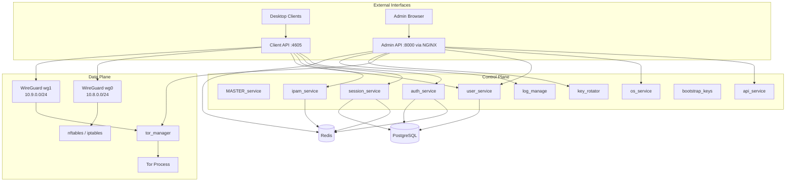
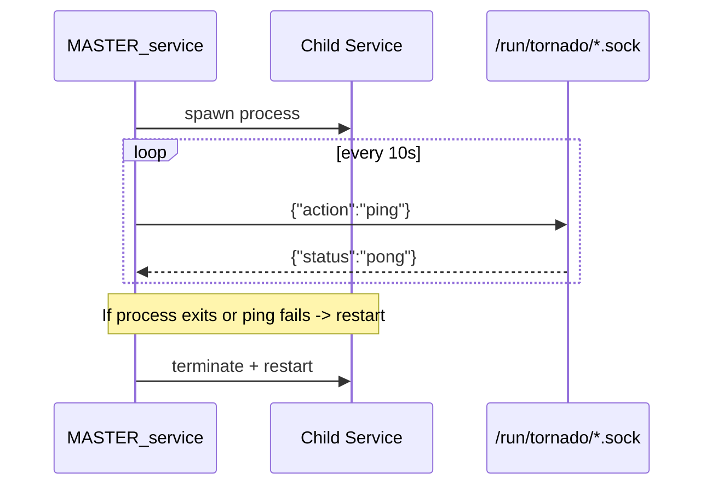
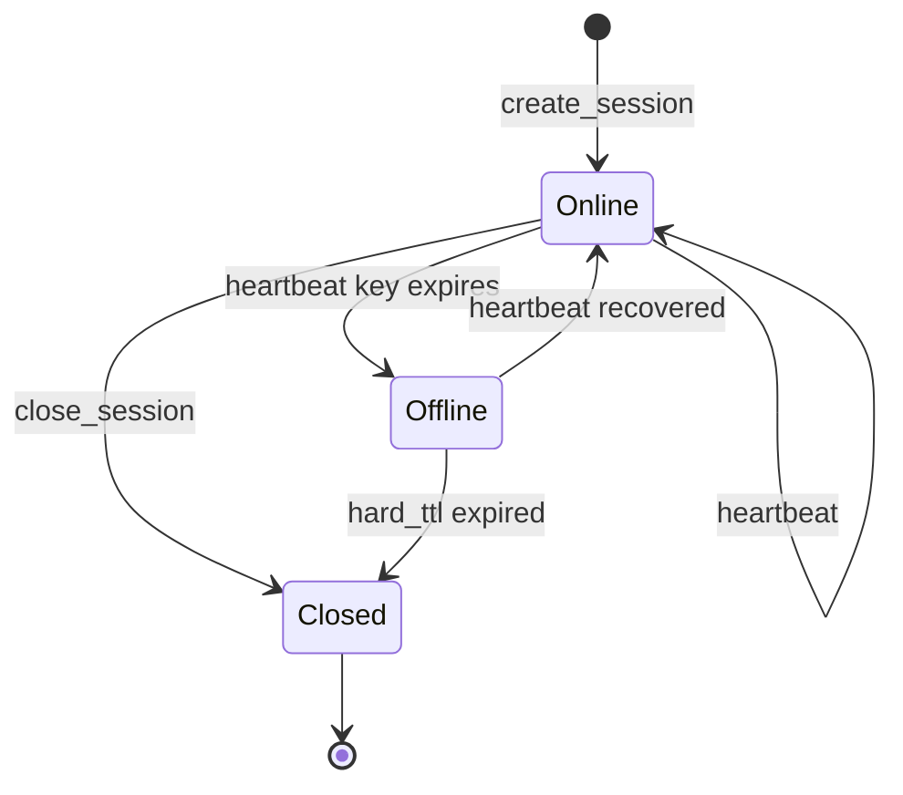
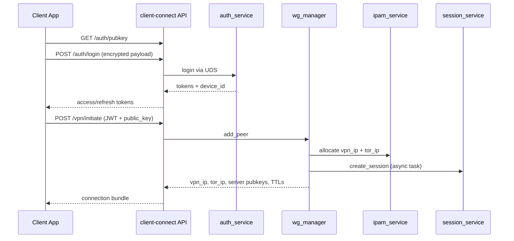
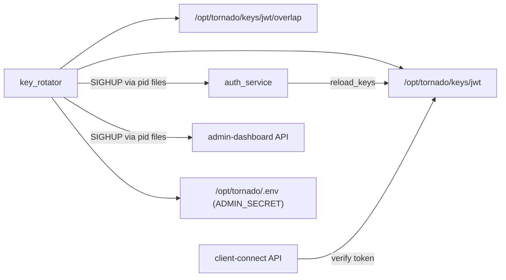

# Architecture and Design

## Architectural Principles

Tornado VPN is organized as a local-service mesh on a single host:

- Process supervision and lifecycle control are centralized in `MASTER_service.py`.
- Service-to-service calls use Unix domain sockets in `/run/tornado/*.sock`.
- External API ingress is isolated to two FastAPI apps (`admin-dashboard` and `client-connect`).
- Runtime state is split between Redis (ephemeral/live) and PostgreSQL (durable/history).

## Control Plane vs Data Plane

## Supervisor Model

`MASTER_service.py` loads `services.json`, drops privileges per service user, creates child processes, and performs liveness checks via each service socket `ping` action. On failed heartbeat or crash, restart is scheduled.

## Session Lifecycle

`session_service.py` owns session state transitions and finalization.

## Authentication and Connection Flow

## Key and Secret Rotation Topology

## Data Stores and Ownership

- Redis session keys: `vpn:session:*`
- Redis heartbeat sentinels: `vpn:session:*:hb`
- Redis IP pools: `vpn:ipam:pool:vpn`, `vpn:ipam:pool:tor`
- Redis live event channel: `vpn:live_events`
- Redis user event channel: `vpn:user_events`
- Redis revocation keys: `revoked_jti:*`
- PostgreSQL tables: `users`, `auth_sessions`, `wg_sessions`, `vpn_session_history`

## Operational Ports and Endpoints

- Admin API bind: `127.0.0.1:8000` (proxied by NGINX)
- Client API bind: `0.0.0.0:4605`
- WireGuard listener ports: `51820` (`wg0`) and `51821` (`wg1`)
- Tor defaults: TransPort `9040`, DNSPort `9053`, control `9051`, maintenance `9041`

## Design Constraints and Tradeoffs

- UDS-first service communication reduces network exposure but keeps services host-coupled.
- Redis keyspace event dependence requires `notify-keyspace-events Ex` to be configured.
- `wg_manager` and `session_service` run as root for network and interface operations.
- Key rotation uses file-based primitives and signal-driven reload; correctness depends on consistent pid file management.
