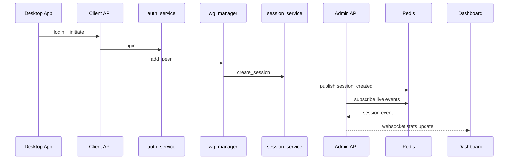

# Code Walkthrough

This walkthrough traces critical runtime paths using current code behavior.

## 1. Process Supervision Boot

Entry point: `server/microservices/MASTER_service.py`

- Loads `services.json`
- Spawns enabled microservices with configured user/cwd/env
- Exposes admin socket for status and process commands
- Performs heartbeat checks by sending `{"action":"ping"}` to service sockets
- Restarts crashed/unhealthy services with delay and task cancellation safety

## 2. JWT Key Readiness Path

Startup dependency chain:

1. `bootstrap_keys.py` ensures RSA key files exist and are valid.
2. `auth_service.py` waits for live keys before accepting requests.
3. `jwt_utils.py` lazily loads keys and supports overlap fallback verification.

This sequencing avoids startup races and mitigates cutover failures during rotation windows.

## 3. Client Authentication Path

Files:

- `server/web-interfaces/client-connect/main.py`
- `server/microservices/auth_service.py`
- `server/tornadoutils/security_utils/jwt_utils.py`

Flow:

1. client fetches auth pubkey from `/auth/pubkey`
2. client submits encrypted login payload
3. API decrypts payload and forwards credentials to auth microservice
4. auth service validates credentials, brute-force guard, device limit, and account status
5. token pair returned to API and then to client

## 4. Peer Provisioning Path

Files:

- `server/web-interfaces/client-connect/main.py`
- `server/microservices/wg_manager.py`
- `server/microservices/ipam_service.py`
- `server/microservices/session_service.py`

Flow:

1. `/vpn/initiate` validates JWT identity
2. wg manager requests dual IP allocation (vpn + tor lanes)
3. wg manager programs peer on both interfaces
4. on partial failure, rollback is attempted and IPAM release is triggered
5. session creation request is emitted to session service

## 5. Session State and Recovery

`session_service.py` handles:

- Redis-backed live session state (`vpn:session:*`)
- heartbeat sentinel keys (`:hb`)
- transition to offline on heartbeat miss
- automatic recovery on resumed heartbeat
- hard cleanup and DB finalization on expiration or explicit close

The service also emits `vpn:live_events` for UI telemetry updates.

## 6. Admin Dashboard Runtime

`server/web-interfaces/admin-dashboard/main.py`:

- serves static admin UI pages
- handles admin auth and token checks
- consumes Redis live events and pushes websocket updates to dashboard clients
- provides control endpoints for services, users, logs, tor, key rotation, and metrics

## 7. Tor Control Path

Files:

- `server/microservices/tor_manager.py`
- admin endpoints in `admin-dashboard/main.py`

Key behavior:

- supports `up` and `down` transitions without full process teardown
- uses nftables to enforce maintenance behavior in down state
- supports full service start/stop semantics and circuit inspection
- publishes structured status usable by admin websocket progress streams

## 8. Logs and Analytics Path

`log_manage.py` performs:

- file tailing via watchdog
- buffered ingest into SQLite with WAL
- query/count/aggregate/top/histogram/search operations
- saved queries and export generation
- SSE tail streaming integration through admin API

## 9. Key Rotation Path

`key_rotator.py`:

- stages new key files
- rotates public keys first
- signals reload targets
- rotates private keys after grace delay
- rotates `.env` admin secret
- cleans overlap keys after reload windows

## 10. Desktop Client Behavior

Linux and Windows clients (`client/*/src/main.py`) implement:

- encrypted login handshake with server pubkey
- dual-mode configuration (standard VPN vs Tor routing)
- heartbeat scheduler using server-provided TTL
- refresh-token reauth and local session persistence
- WireGuard tunnel apply/remove flows with platform-specific commands

## End-to-End Trace

