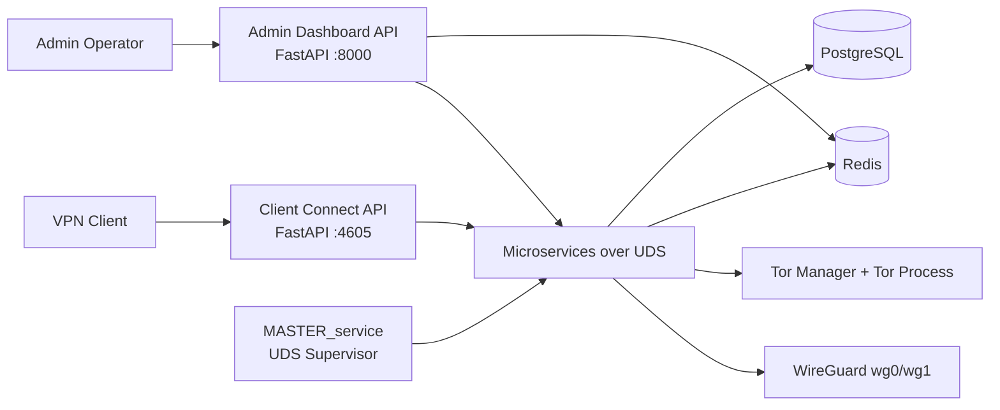

# Tornado VPN Documentation

This documentation set is a code-verified reference for operating, extending, and troubleshooting the Tornado VPN platform.

## Executive Summary

Tornado VPN is a self-hosted VPN control plane and data plane built around:

- WireGuard dual-interface networking (`wg0` for standard VPN, `wg1` for Tor-routed traffic)
- Tor transparent proxy orchestration with maintenance-mode routing controls
- Unix domain socket (UDS) microservice mesh managed by a master supervisor
- FastAPI web interfaces for client connectivity and administrative operations
- Redis-backed live session state and event fanout
- PostgreSQL-backed identity and session history persistence

## Intended Audience

- Platform engineers deploying and operating Tornado VPN
- Security engineers validating key and token lifecycle behavior
- Backend engineers extending control-plane services
- Client engineers building desktop client integrations

## Documentation Map

- `architecture.md`: system topology, service boundaries, and runtime flows
- `setup.md`: production installation, bootstrap, and post-install verification
- `security.md`: auth, token lifecycle, key rotation, and hardening controls
- `operations.md`: SRE runbook, health checks, incidents, and recovery procedures
- `api_reference.md`: API and UDS contract overview
- `code_walkthrough.md`: end-to-end code flow through critical paths
- `project_structure.md`: repository map and module ownership
- `build_linux.md`: Linux desktop client build and packaging
- `build_windows.md`: Windows desktop client build and installer packaging

## Platform At A Glance

## Verified Core Capabilities

- Encrypted login payload exchange using X25519 ECDH + HKDF + AES-GCM before auth service credential validation
- JWT access and refresh token issuance with asymmetric key material loaded from filesystem and overlap-key verification during rotations
- Session lifecycle orchestration with heartbeat/offline/recovery/cleanup transitions and Redis event propagation
- Dual WireGuard peer programming with atomic rollback behavior when one interface update fails
- Tor relay up/down semantics with nftables-based traffic handling and maintenance-page failover behavior
- Admin APIs for service control, user lifecycle management, logs, metrics, and key rotation control

## Versioning Note

This documentation reflects the repository state under `D:\tornado-vpn` and is aligned to the current code paths and configuration contracts in:

- `server/microservices/*.py`
- `server/web-interfaces/*/main.py`
- `server/microservices/*_config.json`
- `server/setup.sh`

