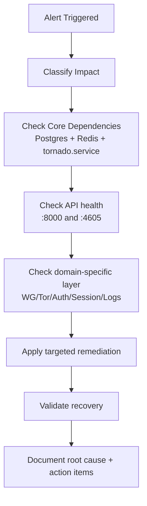

# Operations Runbook

## Day-2 Operations Scope

This runbook covers platform operations for the Tornado VPN server stack:

- service health checks
- routine maintenance
- incident response
- session and network recovery

## Health Check Matrix

| Layer | Check | Expected |
|---|---|---|
| Supervisor | `systemctl status tornado` | active/running |
| Admin API | `curl http://127.0.0.1:8000/health` | JSON `status` healthy |
| Client API | `curl http://127.0.0.1:4605/health` | JSON `status` ok |
| Redis | `redis-cli ping` | `PONG` |
| PostgreSQL | `pg_isready -h 127.0.0.1 -p 5432` | accepting connections |
| WireGuard | `wg show` | wg0/wg1 interfaces active |
| Tor Manager | admin endpoint `/relay/health` | healthy response |

## Service Recovery Order

When full stack recovery is needed, use this order:

1. PostgreSQL and Redis
2. `tornado.service` (starts master and microservices)
3. NGINX
4. API health verification
5. tunnel interface verification (`wg show`)

## Incident: Clients Cannot Establish VPN

1. Verify client API health (`:4605`).
2. Check auth service and wg manager status through admin APIs.
3. Verify IPAM pool availability in Redis.
4. Check WireGuard interface state (`wg0`, `wg1`) and recent logs.
5. Confirm JWT key files exist and are readable.

## Incident: Frequent Session Drops

1. Check Redis keyspace events are enabled (`notify-keyspace-events Ex`).
2. Verify heartbeat TTL and hard TTL expectations from session config.
3. Inspect session service logs for `heartbeat_lost` and `hard_cleanup` frequency.
4. Validate client heartbeat interval behavior relative to returned `heartbeat_ttl`.

## Incident: Token Validation Failures After Rotation

1. Check key rotator status and recent rotation logs.
2. Verify overlap keys exist during expected cutover windows.
3. Confirm pid files used for SIGHUP are valid and current.
4. Force controlled reload or service restart if required.

## Operational Flow



## Log and Metrics Operations

- Log microservice provides query, count, aggregate, histogram, and export actions.
- Admin API exposes live metrics endpoints and websocket streams.
- Export artifacts are written to configured `LOG_EXPORT_DIR`.

## Maintenance Tasks

- Rotate secrets and review key rotator interval policy.
- Validate database retention and log retention expectations.
- Check system packages and security updates.
- Verify backup and restore drills for PostgreSQL data.

## Controlled Restart Procedure

```bash
sudo systemctl restart tornado
sleep 5
curl -sSf http://127.0.0.1:8000/health
curl -sSf http://127.0.0.1:4605/health
wg show
```

## Emergency Containment

For severe incidents:

1. Disable external access at firewall/load balancer edge.
2. Keep internal services up for forensic data extraction.
3. Export logs and preserve system journal.
4. Rotate admin and JWT secrets before restoring ingress.

## Post-Incident Checklist

- Incident timeline with UTC timestamps
- direct cause and contributing factors
- short-term fix and long-term prevention
- backlog tickets for resilience gaps
