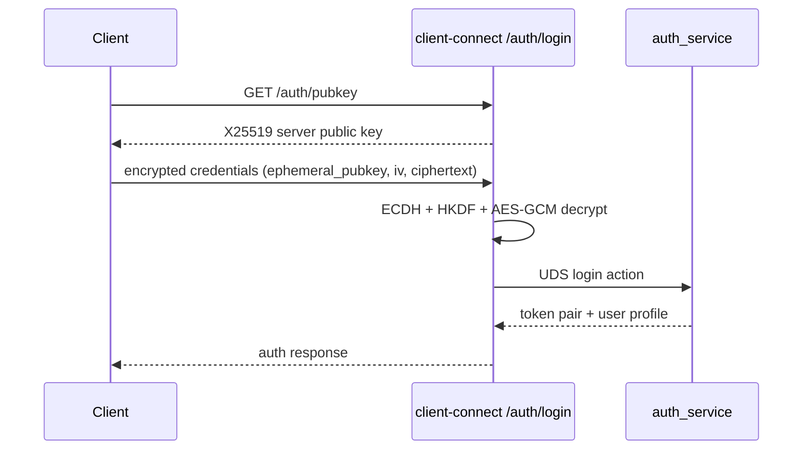
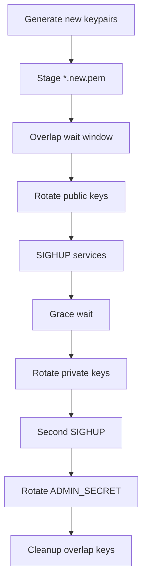

# Security and Key Management

## Security Architecture Overview

Tornado VPN uses layered controls:

- encrypted credential transport (X25519 + AES-GCM) for login payloads
- Argon2 password hashing in persistent user store
- RS256 JWT tokens with key rotation and overlap verification windows
- token revocation via Redis deny-list keyed by JTI
- UDS-only service communication to avoid network exposure of internal services

## Login Cryptography Path

The client login flow uses a server-side auth encryption keypair (`/opt/tornado/auth_enc_key.bin`) and per-request ephemeral public key exchange.

## Token Model

- Access token: RS256, short TTL (15 minutes)
- Refresh token: RS256, longer TTL (7 days)
- Claims include `iss`, `aud`, `sub`, `device_id`, `jti`, `type`, and timestamps
- Access token verification enforces issuer/audience and token type

## Revocation and Reauth

- Refresh reauth path revokes prior refresh `jti` and issues new token pair.
- Logout path revokes refresh token `jti` and removes device mapping from Redis.
- Reuse of revoked refresh tokens is explicitly detected and rejected.

## JWT Key Rotation Strategy

`key_rotator.py` manages asymmetric JWT key lifecycle.

## Bootstrap Key Safety Net

`bootstrap_keys.py` ensures key presence and validity on startup:

- validates PEM integrity for all required key files
- generates missing/invalid keypairs atomically
- signals key rotator to adopt generated baseline
- exposes `key_status` action over UDS for readiness checks

## Admin Authentication Model

Admin dashboard auth (`admin_auth.py`) currently uses:

- credentials from `.env` (`ADMIN_USERNAME`, `ADMIN_PASSWORD`)
- HMAC-signed token model for admin web session flows
- in-memory brute-force guard keyed by source IP

Operational implication:

- admin credential and secret rotation should be included in security runbooks
- multi-node deployments require explicit strategy for shared admin auth state

## Network and Runtime Privileges

- `wg_manager` and `session_service` require root-level network operations.
- Socket permissions and service group ownership constrain which processes can issue privileged UDS calls.
- Tor manager applies nftables controls to force down-state behavior during relay disablement.

## Security Hardening Checklist

1. Enforce HTTPS at reverse proxy and terminate TLS with trusted certificates.
2. Restrict public exposure to required ingress ports only.
3. Protect `/opt/tornado/.env` and `/opt/tornado/keys/jwt/*` with strict file permissions and host access policy.
4. Rotate admin credentials and secrets on schedule.
5. Monitor for revocation anomalies (`token_revoked_reuse_detected`).
6. Centralize logs and alert on repeated authentication failures and restart storms.
7. Validate systemd and file integrity controls on boot.

## Sensitive Paths

- `/opt/tornado/.env`
- `/opt/tornado/keys/jwt/*.pem`
- `/opt/tornado/keys/jwt/overlap/*.pem`
- `/run/tornado/*.sock`
- `/run/tornado/*.pid`
