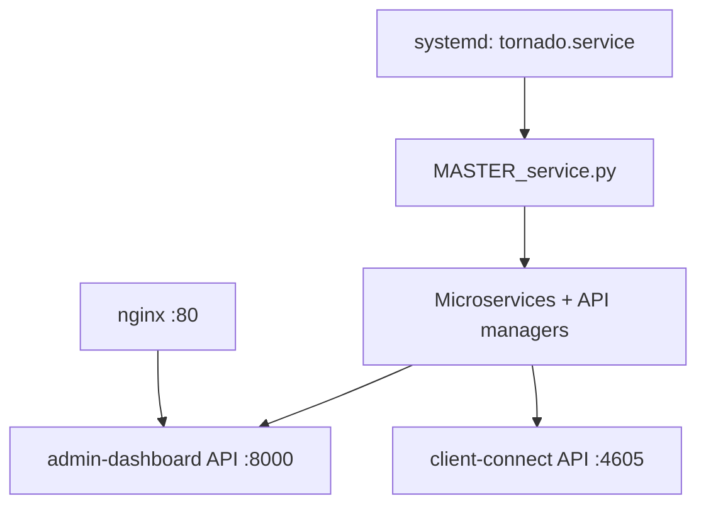

# Setup and Installation

This guide describes production-style installation for the server stack using `server/setup.sh`.

## Deployment Model

- Single-host deployment model
- Linux host with systemd
- Services installed under `/opt/tornado`
- Process supervisor service: `tornado.service`
- API ingress via NGINX to admin API (`127.0.0.1:8000`)

## Minimum Requirements

- CPU: 2 vCPU recommended
- RAM: 2 GB minimum (4 GB recommended for production)
- Storage: 10+ GB available
- Kernel capabilities: WireGuard support and IP forwarding
- User: sudo privileges for installation

## Supported Linux Families

`setup.sh` auto-detects and supports:

- Debian family (`apt`)
- RHEL family (`dnf`)
- Arch family (`pacman`)
- SUSE family (`zypper`)

## What The Installer Configures

1. System update and package installation
2. Service group and user creation (`tornado-services`, `tornado-runner`)
3. Python venv at `/opt/tornado/venv`
4. Project copy to `/opt/tornado`
5. PostgreSQL installation, user/database creation, schema import
6. `.env` generation in `/opt/tornado/.env`
7. Redis installation and enablement
8. Tor installation and enablement
9. NGINX reverse proxy configuration for admin dashboard
10. IP forwarding and NAT (iptables) setup
11. WireGuard package install
12. Systemd unit creation for `tornado.service`

## Getting the Source Code

Before running the installer, clone the Tornado VPN repository to your server. 

```bash

git clone [https://github.com/tornado-vpn/tornado.git](https://github.com/tornado-vpn/tornado.git)

cd tornado/server


chmod +x setup.sh
sudo ./setup.sh
```

During prompts, provide:

- database password for user `tornado_db_user`
- admin credentials (`ADMIN_USERNAME`, `ADMIN_PASSWORD`)
- VPN endpoint host (`VPN_ENDPOINT_HOST`)

## Environment Variables Written To `.env`

The installer writes at least:

- `DB_USER`, `DB_PASS`, `DB_HOST`, `DB_NAME`
- `ADMIN_USERNAME`, `ADMIN_PASSWORD`, `ADMIN_SECRET`, `ADMIN_TOKEN_TTL`
- `HTTPS`
- `LOG_EXPORT_DIR`
- `VPN_ENDPOINT_HOST`, `VPN_ENDPOINT_PORT`, `TOR_ENDPOINT_PORT`

Permissions are set to root-owned group-readable (`640`) for `tornado-services`.

## Post-Install Verification

```bash
sudo systemctl status tornado --no-pager
sudo systemctl status nginx --no-pager
sudo systemctl status postgresql --no-pager
sudo systemctl status redis-server --no-pager || sudo systemctl status redis --no-pager
```

Check admin API health:

```bash
curl -sSf http://127.0.0.1:8000/health
```

Check client API health:

```bash
curl -sSf http://127.0.0.1:4605/health
```

## Network Security & Firewall Requirements

Inbound Firewall Rules (Cloud Security Groups)

If you are deploying on AWS, GCP, or Azure, you must configure your instance's Security Group to allow the following inbound traffic. Without these rules, the VPN tunnels and API endpoints will be unreachable.

| Protocol | Port Range | Source    | Purpose |
| :--- | :--- | :--- | :--- |
| **TCP** | `22` | `0.0.0.0/0` | SSH access for server management |
| **TCP** | `80` | `0.0.0.0/0` | HTTP traffic (NGINX reverse proxy for Admin API) |
| **TCP** | `4605` | `0.0.0.0/0` | Custom TCP for the Client Connect API |
| **UDP** | `51820` | `0.0.0.0/0` | WireGuard Lane 1 (`wg0`) |
| **UDP** | `51821` | `0.0.0.0/0` | WireGuard Lane 2 (`wg1`) |

*Note: For enhanced security, restrict SSH (Port 22) to your specific administrator IP rather than `0.0.0.0/0`.*

## Service Topology After Install



## Common Installer Failure Points

- WireGuard package availability on certain RHEL variants may require extra repos.
- PostgreSQL auth mode can require local `md5` adjustment in `pg_hba.conf`.
- Missing kernel forwarding or iptables persistence can break outbound tunnel traffic.
- Stale `/run/tornado/*.sock` paths are usually auto-cleaned, but can be manually removed when services are fully stopped.

## Safe Re-run Guidance

`setup.sh` includes idempotent steps but also creates persistent resources (database/user, config files). Before rerunning on an existing node:

- back up `/opt/tornado/.env`
- confirm whether DB recreation statements should be manually skipped
- verify existing NGINX and iptables policies to avoid unintended replacement

## Uninstall and Rollback

No full uninstall script is provided. For controlled rollback, perform manual teardown:

- stop and disable `tornado.service`
- remove `/opt/tornado`
- remove `/etc/systemd/system/tornado.service`
- remove NGINX virtual host files created by setup
- remove NAT and forwarding rules if they were dedicated to this stack
- optionally remove PostgreSQL DB/user and Redis data according to policy
